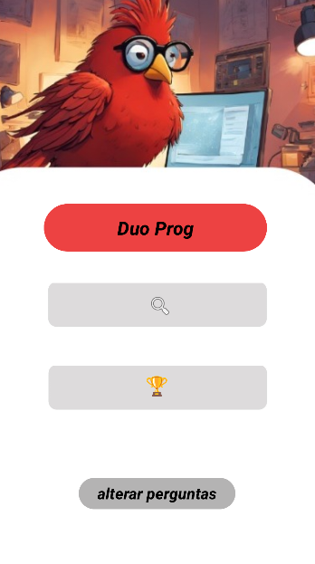
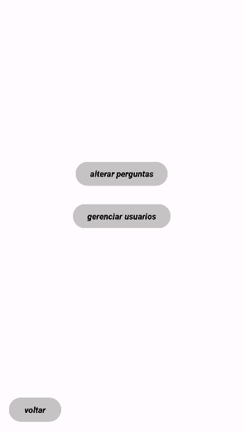
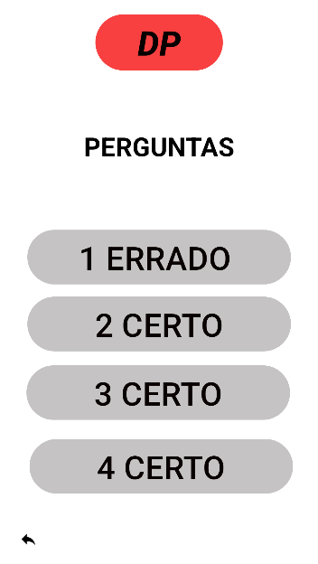

# TrabNarak-24.2 - Plataformas Móveis - Turma T197

# Relatório final
[TemplateDesenvolvimentoPlatMoveis.pdf.pdf](documentacaoatualizada (2).pdf)

# Integrantes 


Davi Klein, Josué Castro e Pedro Lucca


# Visão Geral

O aplicativo Duoprog foi desenvolvio para atender à necessidade de imersão dos novatos na área de programação a se aprofundar nos conteúdos básicos para se tornar um programador, visando melhorar a educação nessa área.

A proposta do aplicativo visa melhorar a experiência dos usuários, oferecendo conteúdos básicos, médios e avançados sobre programação, tanto em linguagens específicas quanto de lógica no geral.


# Funcionalidades

## Funcionalidades do Duoprog

### Para Usuários:

- Possibilidade de responder a módulos com conteúdos específicos selecionados pelo próprio usuário
- Busca por aprendizagem de conteúdos de novas linguagens.
- Navegação por meio de barra de pesquisa.
- Acesso a módulos com conteúdos de aprendizagem.
- Opção de seleção de dificuldade dos módulos.
- Feedback de retorno sobre a performance do usuário ao responder os questionários.

### Para Administradores:

- Login seguro para acesso ao sistema de administração.
- Capacidade de adicionar, excluir e reorganizar questões e módulos ao banco de dados.
- Edição de perguntas e respostas.


# Instalação
Para instalar o Aplicativo Duoprog, siga estes passos:

```
git clone https://github.com/davidkleinn/Android-Studio-Projects.git
```

Abra no Android Studio

```
Abra o Android Studio e selecione File > Open.
Navegue até o repositório clonado e abra.
```

Construa o Projeto

```
Clique no menu "Build" e selecione "Build Project".
Certifique-se de que não há erros antes de continuar.
Execute o Aplicativo
```

Conecte seu dispositivo Android ou inicie um emulador.

```
Clique no botão "Run" ou selecione Run > Run 'app'.
```

# Screenshots

### Tela de Menu (usuário)



### Tela de funções administrativas (ADM)


### Tela perguntas (usuário)
